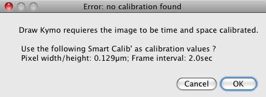

# The KymoToolBox plugin

# Chapter 1: How to install the plugin?

First, close ImageJ in case the software is already running. Copy and paste the KymoToolBox.jar file you(ve downloaded from the [release section](https://github.com/fabricecordelieres/IJ_KymoToolBox/releases) into the ImageJ/Plugins folder. Restart ImageJ. A KymoToolBox entry should appear under the ImageJ’s plugins menu. It contains 4 entries:

- Improve Kymo;
- Draw Kymo;
- Multiple Draw Kymo;
- Analyse Kymo.

# Chapter 2: Improve kymo

## 2.1 What does it do?

As stated in its name, this plugin is meant to improve the way the kymograph looks. It does so by filtering the original image or stack by a process close to a "à trou" wavelet filtering, using a gaussian as wavelet. The original image is first copied n times. Each copy is convolved by a gaussian kernel of radius n. The difference between two successive images is then computed in order to generate a wavelet plane. Several successive wavelet planes are then summed to produce the filtered image (see figure 2.1).

Figure 2.1: How does "Improve Kymo" work?

Figure 2.2: Improve Kymo plugin’s interface

## 2.2 How to use it?

The plugin’s interface is quite simple (see figure 2.2): it consists of two boxes used to enter the first and last wavelet plane to sum and a tick box to generate a preview of the result. Once the setup has been done, simply click on the "Ok" button.

## 2.3 Known issues (to date...) and workarounds (if any...)

- When "Preview" is checked, an automatic gray level balance is done. It may totally corrupt the image display. In this situation, make a copy of a single image of the stack to filter (Image/Duplicate, untick "Duplicate entire stack") and try a first pair of start/stop values.

# Chapter 3: Draw kymo

## 3.1 What does it do?

This plugin provides the user with 3 way to present the data:

- **kymograph**, the time vs time representation of the object’s movement along the user defined path;
- **kymoStack**, a stack containing straightened images of the user defined path, for each time point;
- **kymoMontage**, a montage generated using the kymoStack.

**WARNING**: for all the above mentionned representations, the chosen path is first straightened using ImageJ’s built-in function (Edit/Selection/Straighten). This implies that a selection wider than the actual user defined line, but centered on the line selection, will be used. Its width should be equal or larger than 10 pixels (5 pixels on both sides).
To build the kymograph, only the maximum intensity pixel along the selection width will be retained. This does not apply for the 2 other representations.

## 3.2 How to use it?

First, the image should be space and time calibrated. ImageJ should not have a global calibration set as this will be applied by default to the kymograph. The plugin will check this and ask the user for what to do. The image should carry a selection. It might either be a line, segmented line or freehand selection. For the 2 last types of selection, right-click on the line selection tool and choose the appropriate one. If the stacks fails to meet one at least one of the two requierements, an error message box will appear (see figures 3.2 and 3.3). In case the image is not calibrated, if a Smart Calib’ has been created, "Draw Kymo" will propose to apply it on the stack (see 6.2 for more details). If not, the "Image/Properties" window will pop-up. To define the selection, it is advised to first generate a maximum intensity projection of the stack (Image/Stacks/Z project), then use the selection tool to draw the region. By first clicking on the original stack, then going to Edit/Selection/Restore selection, the selection might be transfered from the projection to the stack. Alternatively, one may use the "Roi Manager": by pressing the "t" key, the Roi (region of interest) is stored. Click on the original stack, then on the Roi within the Roi Manager to restore it. If the current stack does not carry such calibration informations, an error message will first popup (see figure 3.2):

Figure 3.1: Error message: the image is not calibrated, no Smart Calib’ set

Figure 3.2: Error message: the image is not calibrated, but a Smart Calib’ is available

Figure 3.3: Error message: no ROI defined on the image

Once Oked, the Image/Properties window will appear (see figure 3.4):

Figure 3.4: Calibration window: fill-in both space and time calibrations

If necessary, relaunch the plugin. Now, its interface should appear (see figure 3.5). Select the width to consider for straightening (in a way, it corresponds to the dilatation that should be applied to the selection prior to straightening), the time intervalle and tick the boxes corresponding to the views to generate.

Figure 3.5: Draw Kymo plugin’s interface

Figure 3.6 shows an example of the kymograph, the kymoStack and the kymoMon-
tage:

Figure 3.6: An example of kymograph, kymoStack and kymoMontage

As the selection is surely neither horizontal nor vertical, the resulting representation does not carry the same calibration as the original image. Don’t worry! The new calibration is automatically calculated, based on the interpolation that have been made. The frame intervalle is also logged into the image’s properties(no interpolation to be done there).

All the output images will carry in their properties’ field an additionnal information accessible using the Image/Show infos menu. On the upper part of the window stands a text starting with"<KymoPathCoord>"and ending by"</KymoPathCoord>". Those two delimiters enclose two other fields: "<x>....</x>"and"<y>...</y>". They contain both the x and y coordinates composing the path from where the kymograph, kymoStack and/or kymoMontage where made. The cordinates are tabulation
separated. This information is requiered for the later analysis step.

## 3.3 Known issues (to date...) and workarounds (if any...)

- Under Windows, the coordinates from the "<KymoPathCoord>" string appear rather concatenated than tabulation separated. This is however a simple display problem: retrieving coordinates from a macro or a plugin is not an issue.

# Chapter 4: Multiple Draw kymo

## 4.1 What does it do?

This plugin generates a serie of kymographs, kymoStacks and/or kymoMontages based on roi stored in the RoiManager. Basically, this plugin successively recalls the stored roi onto the current stack, then calls the "Draw Kymo" plugin (see 3.1 for more information).

## 4.2 How to use it?

As for the "Draw Kymo" plugin, the image should be first space and time calibrated (see 3.1 for a "How to"). Using the same procedure as explained earlier, the objects’ path should be highlighted, using one of the line selection tools. Press the "t" key to add the current Roi to the RoiManager. Repeat this step for any additional track. In case the plugin is launched without a RoiManager opened, or if the RoiManager is empty, the following error message shall popup:

Figure 4.1: Error message: No Roi Manager, or empty Roi Manager

The interface is exactly the same as for "Draw Kymo", so please refer to 3.5 for a snapshot and 3.1 for explanations.

# Chapter 5: Analyse kymo

## 5.1 What does it do?

This plugin analyses the kymographs generated using either the "Draw Kymo" or "Multiple Draw Kymo" plugins. It requieres the kymograph to have the "<KymoPathCoord>" string written in its properties (see 3.2 for more information). The RoiManager should be opened and contain at least one Roi. "Analyse Kymo" only consider line and segmented line selections. Moreover, it will automatically detect horizontal selections and drop them from the analysis while sending a message in the log window. The selections might be traced either from the top of the image to the bottom or the opposite way round. In the latter case, the plugin will invert the Roi’s coordinates. However,care should be taken when tracing the path as no "loop" in time is allowed: a check is done in order to be sure that for all pointstimen+1> timen. Otherwise, the track is excluded from analysis and the following message is logged: "Roi XXX includes time loops: KymoToolBox is not suitable for analysis of objects travelling back in time...". If all requirements are fulfilled, the interface window should show up (see 5.3). "Analyse Kymo" provides the user with two types of outputs: images and results table.

### 5.1.1 First type of output: Images

Two kinds of views might be generated:

- The **Show colored kymo** option generates a colored encoded overlay of the path over the original kymograph. Outward parts of the track are colored in green, inward in red and pausing steps in blue. The output image is a composite image,channel 1 being a 8-bits image of the tracks on which a specific LUT (lookup table) has been applied; channel 2 being the original kymograph image, converted to 8-bits. Using Image/Color/Channels tools, the user might activate/desactivate the display of any of the channels. Both images might also be separated by using Image/Color/Split channels.
- The **Report coordinates on original stack** option generates a colored encoded overlay of the extrapolated object’s position on the original stack. The same color encoding and data handling as for the "Show colored kymo" option is applied. Please keep in mind that the coordinates used to generate this view are interpolated and may not reflect the exact reality. When creating the kymograph, the original path has been fitted to a spline, therefore smoothed, and a "maximum intensity projection" done on the full width of a widened selection... In case a straightening width of 10 was used, the actual position of the object might be artificially drifted of up to 5 pixels away from its original position! The output is meant for display only, not for precise analysis.

Figure 5.1: An example of "Show colored kymo"

Figure 5.2: An example of "Report coordinates on original stack"

### 5.1.2 Second type of output: Results tables

Three kinds of Results tables might be generated:

- The **Results** table is the output generated by default. It contains one line of summary information per track. To make the understanding of the following section easier, we will define the term "track" as referring to the full path or user defined selection that describes the movement of one object. A "segment" will be defined as the portion of the track between two changes of state i.e. change of direction and change from the mobile state to a pausing state (or the reverse). It contains the following measurements, expressed using the image’s calibration units:
  - **Kymonb**: self-explanitory;
  - **MeanSpeed**: CumDist/TtlTime (therefore includes the pausing times);
  - **MeanSpeedIn**: CumDistIn/TimeIn (therefore excludes the pausing times);
  - **MeanSpeedOut**: CumDistOut/TimeOut (therefore excludes the pausing times);
  - **CumDist**: sum of all the lengths of each single "segment";
  - **CumDistIn**: sum of all the lengths of each single inward "segment";
  - **CumDistOut**: sum of all the lengths of each single outward "segment";
  - **MinDistStart-End**: straight distance between the first and the last points of the "track";
  - **Persistence**: CumDist/MinDistStart-End;
  - **FreqXXX>YYY (ex: "FreqIn>Out")**: number of transitions from one state (moving outward, moving inward or pausing) to another, per unit of time;
  - **TtlTime**: self-explanitory;
  - **%TimeIn, %TimeOut, %TimePause**: self-explanitory.
- The **Full Results** table contains all the above information (when appropriate) for each single "segment". It is only generated if the "Log all data" box has been checked. Data relative to one kymograph ends by a summary, including all the above mentioned parameters.
- The **Extrapolated coordinates** table contains what are expected to be the (x,y) coordinates of the object on the original stack. Those coordinates are used to draw the overlay generated by the "Report coordinates on original stack" option. Therefore, same caution as mentioned earlier applies for this type of result (see 5.1.1 for more details).

## 5.2 How to use it?

The "Analyse kymo" interface (see below 5.3) allows several parameters to be set:

Figure 5.3: Analyse Kymo plugin’s interface

- **Outward is...**: enables choosing from the drop-down list the outward direction;
- **Lim. speed**: defines the minimum speed to consider an object as moving. In case Limspeed> speed >−Limspeed, the object will be considered as static;
- **Line width**: width of the line to use on the "Show colored kymo" output;
- **Log all data**: returns the full results table (see 5.1.2 for more details);
- **Log extrapolated coordinates**: returns the extrapolated (x, y) coordinates in a new table (see 5.1.2 for more details);
- **Show colored kymo**: when this box is checked, a composite image is generated containing 2 channels: the colored paths on channel one, a 8-bits copy of the kymograph on channel 2 (see 5.1.1 for more details);
- **Report coordinates on original stack**: generates a colored encoded overlay of the extrapolated object’s positions on the original stack (see 5.1.1 for more details). The stack might be chosen amongst the opened images using the drop- down list. In case several kymographs’ data have to be reported onto the stack, first select the original stack on the list. For the additional kymographs, select the overlay instead of the original stack: the dots will be added to it;
- **Dot size**: radius of the dots to be used while building the output image for the "Report coordinates on original stack" option.

# Chapter 6: Smart Calib’

## 6.1 What does it do?

This plugin doesn’t do any processing on the image. It provides the user with a way to apply a default calibration to the stack, to be used with either "Draw Kymo" or "Multiple Draw Kymo", in case it does not already carry one.

## 6.2 How to use it?

Simply fill in all the fields of the plugin’s interface (see 6.1) then press Ok:

Figure 6.1: Smart Calib’ plugin’s interface

# Acknowledgments

*Thanks to Elizabeth Crowell for giving me the first challenge: writing an ActionBar to reduce the time required for getting "only" the kymograph, and for requesting the "Report coordinates on original stack" feature.
Thanks to Diana Zala and Patrick Pla for the intensive beta testing of the plugin, and making the necessary feedbacks.*

# Reference

When using the plugin, please cite the following paper:
[Vesicular Glycolysis Provides On-Board Energy for Fast Axonal Transport, Zala, Diana et al., Cell , Volume 152 , Issue 3 , 479 - 491](http://dx.doi.org/10.1016/j.cell.2012.12.029)
